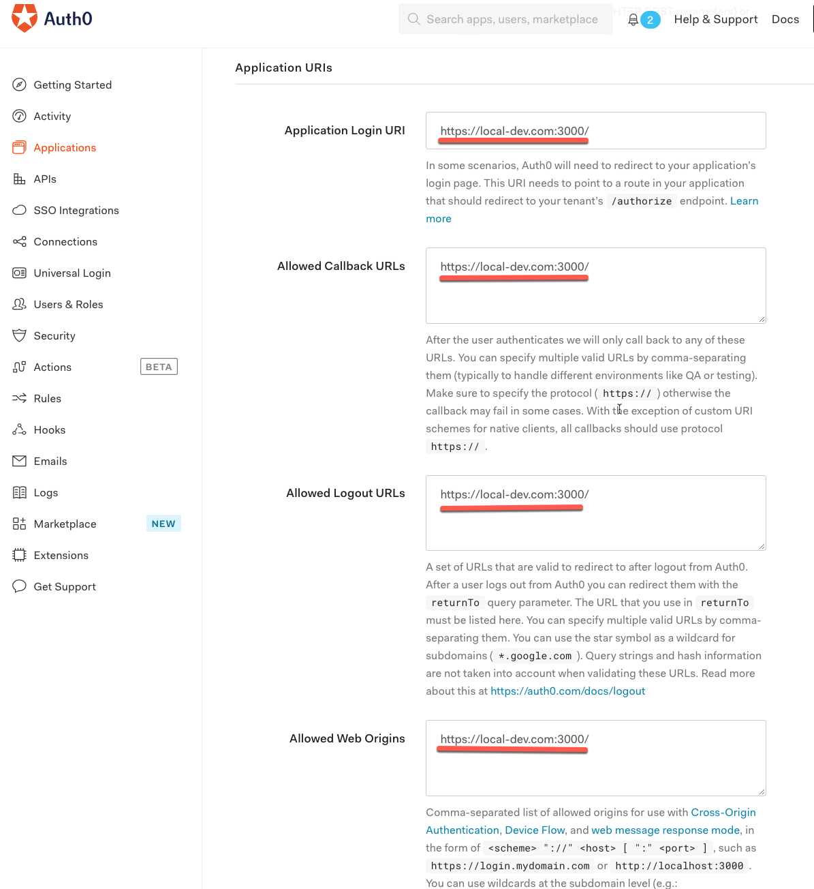
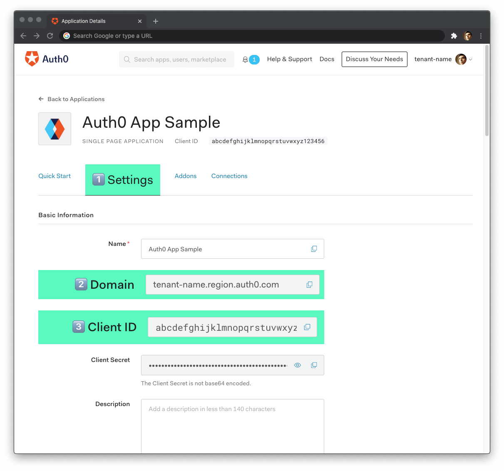

<!-- TOC ignore:true -->
# Vice React, React Query, FeatherJs Boilerplate - Web App
Web App for Vice Software&#39;s react, react-query and feathersjs boilerplate.

> **Note:** This project uses [create-react-app](https://create-react-app.dev/). An open source toolchain for building React applications. See more details [here](#Getting-Started-with-Create-React-App).

> **Note:** we are using Auth0 for authentication. You can sign up for an account at www.auth0.com. See more details [here](#Authentication).

<!-- TOC ignore:true -->
# Table of Contents

<!-- TOC -->

- [Vice React, React Query, FeatherJs Boilerplate - Web App](#vice-react-react-query-featherjs-boilerplate---web-app)
- [Running a Dev Build](#running-a-dev-build)
    - [Authentication Setup](#authentication-setup)
    - [Running the Database](#running-the-database)
    - [Running Web App](#running-web-app)
- [Getting Started with Create React App](#getting-started-with-create-react-app)
    - [Available Scripts](#available-scripts)
        - [yarn start](#yarn-start)
        - [yarn test](#yarn-test)
        - [yarn build](#yarn-build)
        - [yarn eject](#yarn-eject)
    - [Learn More](#learn-more)

<!-- /TOC -->

# Running a Dev Build
Below are the steps needed to setup and run a dev build.

## Authentication Setup
> **Note:** You need to have the API running before running the frontend so please follow the steps in the [API's readme](../api/README.md) before proceeding.

> **Note:** Instructions are provided for Mac's below. If you are using a PC you might need to look up how to do things like modifying your `/ect/hosts` file.

To get your authenitcation configured follow the following steps:
1. Log into your account at www.auth0.com
1. Create a new application of type `Single Page Application`
1. Update the new applications settings as shown below with value `https://local-dev.com:3000/` and save the changes.
   
   
   > **Note:** Auth0 requires https and a non localhost domain to work properly. They also have a bug that your domain has to have a `.com` or something similar in it and not just be something like `https://local-dev:3000/`.

1. Update your `/etc/hosts` file to add an entry like below
   ```
   127.0.0.1       local-dev.com
   ```
   this will make `local-dev.com` resolve to `127.0.0.1` which should resolve to `localhost`. You can find instructions for how to do this on a mac [here](https://www.dalendesign.com/webpress-blog/webmaster-tools/edit-hosts-file-in-mac-terminal/)

   > **Note:** if this doesn't work make sure you have this entry in your `/etc/hosts` file too: 
   > ```
   > 127.0.0.1       localhost
   > ```
1. flush your dns so your changes to `/ect/hosts` apply. On mac you can use the following command:

   ```
   dscacheutil -flushcache
   ```

1. Add a `./web/.env` file and update it as shown below

   ```
   REACT_APP_AUTH0_DOMAIN=<your domain from your application in auth0>
   REACT_APP_AUTH0_CLIENT_ID=<your client id from your application in auth0>
   ```
   You can find your `domain` and `client id` in your auth0 dashboard as shown below. Get full details in the "Add the Auth0 configuration variables to React" section of this [article](https://auth0.com/blog/complete-guide-to-react-user-authentication/).
   

## Running the Database
From the root directory of this repository run `docker-compose -f docker-compose-dev.yml up`. This will run a POSTGres instance locally. You can look in the `../docker-compose-dev.yml` file for the DB details including port, username and password so you can verify the install with a tool like PostIco.

## Running Web App
To run the web app:

1. from the `./web` directory
2. `yarn install`
3. `yarn start`

# Getting Started with Create React App

This project was bootstrapped with [Create React App](https://github.com/facebook/create-react-app).

## Available Scripts

In the project directory, you can run:

### `yarn start`

Runs the app in the development mode.\
Open [http://localhost:3000](http://localhost:3000) to view it in the browser.

The page will reload if you make edits.\
You will also see any lint errors in the console.

### `yarn test`

Launches the test runner in the interactive watch mode.\
See the section about [running tests](https://facebook.github.io/create-react-app/docs/running-tests) for more information.

### `yarn build`

Builds the app for production to the `build` folder.\
It correctly bundles React in production mode and optimizes the build for the best performance.

The build is minified and the filenames include the hashes.\
Your app is ready to be deployed!

See the section about [deployment](https://facebook.github.io/create-react-app/docs/deployment) for more information.

### `yarn eject`

**Note: this is a one-way operation. Once you `eject`, you can’t go back!**

If you aren’t satisfied with the build tool and configuration choices, you can `eject` at any time. This command will remove the single build dependency from your project.

Instead, it will copy all the configuration files and the transitive dependencies (webpack, Babel, ESLint, etc) right into your project so you have full control over them. All of the commands except `eject` will still work, but they will point to the copied scripts so you can tweak them. At this point you’re on your own.

You don’t have to ever use `eject`. The curated feature set is suitable for small and middle deployments, and you shouldn’t feel obligated to use this feature. However we understand that this tool wouldn’t be useful if you couldn’t customize it when you are ready for it.

## Learn More

You can learn more in the [Create React App documentation](https://facebook.github.io/create-react-app/docs/getting-started).

To learn React, check out the [React documentation](https://reactjs.org/).
